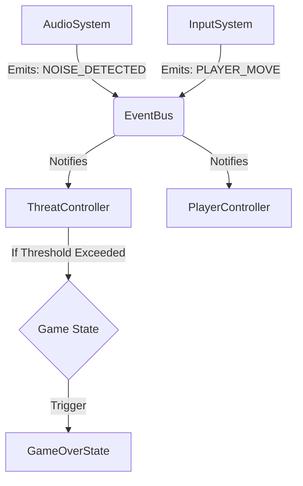

# 🤫 Shut Up! - Immersive Web Horror

> **Silence is your only survival mechanism.**


## 📖 Descripción del Proyecto

**Shut Up!** es una experiencia de terror psicológico en primera persona 3D desarrollada para la web. Inspirado en mecánicas de juegos como *Don't Scream*, este proyecto utiliza la **Web Audio API** para romper la cuarta pared: el juego escucha al jugador a través de su micrófono real.

El objetivo es atravesar un entorno claustrofóbico y procedimental sin emitir sonido. Si el jugador grita o hace ruido fuerte en la vida real, la entidad del juego lo detecta y la partida termina instantáneamente.

---

## ⚙️ Arquitectura de Software

Para garantizar la escalabilidad y permitir el desarrollo en paralelo entre los integrantes del equipo, hemos implementado una **Arquitectura Orientada a Eventos (Event-Driven)** combinada con una **Máquina de Estados Finitos (FSM)**.

### Patrones de Diseño Utilizados
* **Observer (Pub/Sub):** Implementado en el `EventBus`. Desacopla los sistemas de entrada (micrófono/teclado) de la lógica de juego.
* **State Pattern:** Gestión robusta del flujo del juego (`Menu`, `Playing`, `GameOver`).
* **Singleton:** Instancia única para el `GameEngine` y el `EventBus`.
* **Factory Method:** Generación dinámica de eventos de susto (*ScareFactory*).

### Diagrama de Comunicación



---

## 📂 Estructura del Repositorio

El proyecto sigue una estructura orientada a dominios para mantener la separación de responsabilidades:

```text
/shut-up-game
│
├── /src
│   ├── /core           # Núcleo del Engine (EventBus, StateMachine)
│   ├── /interfaces     # Contratos TypeScript (IState, IScare, IConfig)
│   ├── /systems        # Lógica pura sin estado (AudioAnalyzer, InputHandler)
│   ├── /states         # Estados del juego (MenuState, PlayState, GameOverState)
│   ├── /entities       # Entidades del mundo (Player, Hallway, Monster)
│   ├── /logic          # Reglas de negocio (ScareFactory, Rules)
│   └── main.ts         # Punto de entrada
│
├── /public             # Assets (Modelos .glb, Sonidos, Texturas)
├── package.json        # Dependencias
└── tsconfig.json       # Configuración estricta de TypeScript
```

---

## 🚀 Instalación y Despliegue

### Prerrequisitos
* **Node.js** (v16 o superior)
* **Navegador Web** con soporte para WebGL 2.0 y permisos de micrófono.

### Pasos
1.  **Clonar el repositorio:**
    ```bash
    git clone https://github.com/2025-b-sw-juegos-interactivos-gr3/Shut-Up.git
    cd shut-up-game
    ```

2.  **Instalar dependencias:**
    ```bash
    npm install
    ```

3.  **Ejecutar entorno de desarrollo:**
    ```bash
    npm run dev
    ```
    El juego estará disponible en `http://localhost:8080`.

---

## 📋 Gestión del Proyecto

Utilizamos **GitHub Projects** con metodología Kanban para la gestión de tareas.

* **Tablero de Proyecto:** https://github.com/orgs/2025-b-sw-juegos-interactivos-gr3/projects/2

### Nomenclatura de Tickets
Para mantener la trazabilidad, utilizamos los siguientes prefijos en los Issues:
* `TAR-###`: **Tareas Administrativas** (Gestión, Documentación, Diseño).
* `IM-###`: **Implementación** (Código, Bugs, Features).

---

## 🎮 Controles

| Acción | Entrada |
| :--- | :--- |
| **Moverse** | `W`, `A`, `S`, `D` |
| **Mirar** | Mouse |
| **Interactuar** | `E` o `Click Izquierdo` |
| **Sobrevivir** | **MANTENER SILENCIO ABSOLUTO** 🎤 |

---

## 🛠 Tecnologías

* [Babylon.js](https://www.babylonjs.com/) - Motor de renderizado 3D.
* [TypeScript](https://www.typescriptlang.org/) - Lenguaje principal.
* [Web Audio API](https://developer.mozilla.org/en-US/docs/Web/API/Web_Audio_API) - Procesamiento de señales de audio (FFT).
* [Vite](https://vitejs.dev/) - Entorno de desarrollo y bundler.

---

## 👥 Equipo de Desarrollo

Estudiantes de Ingeniería de Software - EPN:

* **Alexander Morales** - *PM y backend*
* **Alex Escobar** - *Frontend*

---
